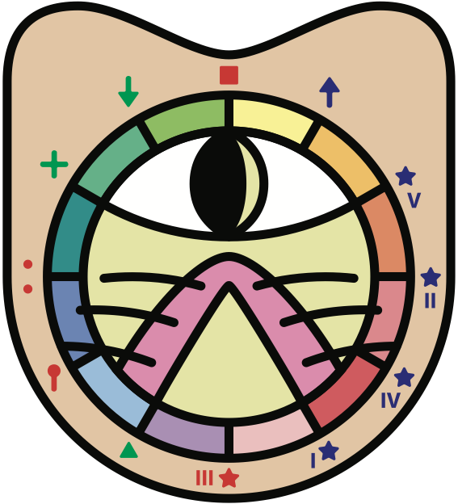

# fractalmusic

<p align="center">
  
</p>

Patricio Torres's **Sistema Fractal** — the *Dodecamundo*, the *Gátople* clock,
the 12 Greek + Penta modes, pentatonic-first scales, the 12 *cartas*, and the
etno-matemática chord formulas — implemented as a typed layer over
[pytheory](https://pytheory.org).

New to the system itself? Read **[¿Qué es Fractal Music World?](./QUE_ES_FRACTALWORLD.md)**
first — it explains the method, grounded in the book *El Sistema Fractal* (2024).

Everything is **A-origin** (La menor / matriarchal), which is also pytheory's
native tone order: index 0 = A, index 3 = C.

## Install

```bash
uv venv
source .venv/bin/activate
uv pip install -e .
```

For development tooling:

```bash
bash scripts/setup_dev.sh
source .venv/bin/activate
```

## Use

```python
import fractalmusic as fm

print(fm.deck())                      # the 12 cartas, colored + glyphed
fm.world("Bb")                        # → NoteWorld for A# (enharmonic-aware)
fm.mode_for("C")                      # → Jónico, □, major, 12 o'clock
fm.penta("C#", mode="I")              # C# D# F# G# A# — Penta 1 (no semitones)
fm.cero_pitagoras("A")                # ['A','B','D','E','F#'] — 5-note penta seed
fm.spell(["A", "C", "E"])             # '⋮ □ ♀' — a chord written in glyphs
fm.interval_angle("A", "C")           # 90.0° on the Gátople
fm.fibonacci_chord("A", voices=4)     # chord stacked by Fibonacci offsets
fm.microstructures()                  # all 60 (5 penta modes × 12 roots)
```

## What it models (from the book)

| Concept | Module | Notes |
|---|---|---|
| Dodecamundo — 12 note-worlds | `dodecamundo.py` | note + mode + glyph + color + number + roman |
| 12 modes (7 Greek + 5 Penta) | `modes.py` | canonical glyph, quality, clock-hour per Ch. 4 & 8 |
| Gátople clock | `gatople.py` | angles, intervals, polygons, Cero Pitágoras |
| Pentatonic-first scales | `scales.py` | 5 modes, 60 microstructures, penta→hepta |
| The 12 cartas | `cartas.py` | truecolor cards, piano/fretboard stickers |
| Fibonacci / Pythagoras | `formulas.py` | chord building, ratios, chessboard potenciación |
| Glyphs & color wheel | `symbols.py`, `colors.py` | the 8-symbol vocabulary, 12-hue palette |

### The 5 + 7 = 12 skeleton

```
7 naturals (white keys) → Greek modes:  A⋮  B△  C□  D+  E♀  F↑  G↓
5 black keys → pentatonic stars:         A#★V  C#★I  D#★II  F#★III  G#★IV
```

## See it in color

```bash
fractalmusic              # or: python -m fractalmusic.showcase
```

prints the full system in 24-bit terminal color — the 12 cartas, the color
wheel, the 7 Greek modes, the 5 Penta modes, the Gátople clock (hour + angle),
and sample chords spelled in glyphs:

```
THE 7 GREEK MODES (white keys)
⋮ Eólico     minor       A  B  C  D  E  F  G    ⋮ △ □ + ♀ ↑ ↓
△ Locrio     diminished  B  C  D  E  F  G  A    △ □ + ♀ ↑ ↓ ⋮
□ Jónico     major       C  D  E  F  G  A  B    □ + ♀ ↑ ↓ ⋮ △
...
THE GÁTOPLE CLOCK (hour & angle from A)
⋮ A   Eólico      9 o'clock       0°
□ C   Jónico     12 o'clock      90°
★ F#  Penta 3     6 o'clock     270°
...
COMBINATIONS — music written in glyphs
A minor triad          A  C  E                ⋮ □ ♀
Cero Pitágoras (A)     A  B  D  E  F#         ⋮ △ + ♀ ★
```

## Testing

Three tiers, **89 tests, ~98% coverage**:

```bash
make test                         # pytest with coverage (all tiers)
make check                        # lint, format, type-check, test, security scan
uv run pytest tests/unit          # 67 — data model & invariants
uv run pytest tests/integration   # 13 — cross-module + pytheory interop
uv run pytest tests/uat           # 9  — Gherkin behavioral scenarios
```

- **Unit** — Dodecamundo, modes, scales, Gátople geometry, formulas, cartas.
- **Integration** — every world round-trips through pytheory; glyphs and
  clock-hours stay consistent across modules; Eólico and Jónico are relatives.
- **UAT** — pytest-bdd features (`tests/uat/features/*.feature`) written from the
  learner's point of view: *learning the Dodecamundo*, *composing with the Gátople*.

## Status & provenance

The canonical bindings (note→mode→glyph→clock-hour, penta-mode spellings, the
A-origin) are taken from *El Sistema Fractal: Música Viva y en Reproducción*
(Torres, 2024), chapters 3–9. The **color palette** in `colors.py` is an
interpretation of the hand-painted cartas and the Gátople logo — swap `WHEEL_HEX`
for the exact card colors when the originals are digitized.

*All rights to the Sistema Fractal and the Gátople belong to Patricio Torres
Rivera / Fractal Music World. This repository is a study implementation.*
