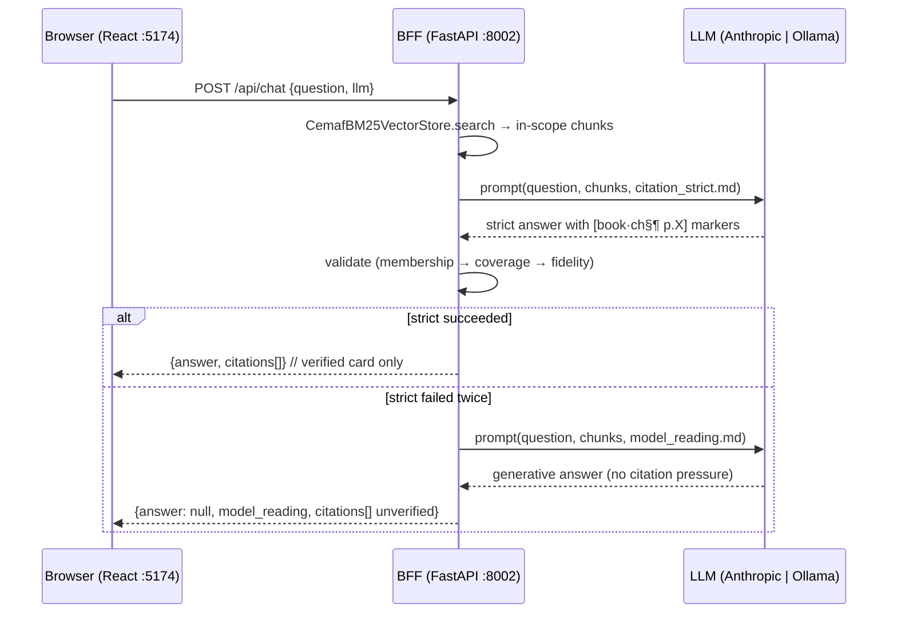

# SPEC-chat-v1 — pregunta a los libros

## 1. Context

The wheel teaches the *shape* of the Sistema Fractal. The books explain it. Today the books are reachable only from a CLI. **chat-v1** adds a chat panel to the React app so a learner can ask questions and get two complementary kinds of replies:

1. **Verified answer** — every factual sentence anchored to a specific chunk in the indexed corpus. The rigorous spine.
2. **Model reading** — a generative answer that uses the retrieved passages as evidence and may bring in general music theory to bridge gaps. Returned ONLY when the verified path fails (no usable citations). Clearly labeled as interpretive, not verbatim.

The two replies never blend in a single rendered answer. Either the user sees the verified answer, OR they see the model reading + the retrieved passages displayed side-by-side as `Pasajes encontrados`. Single-turn, no history, no streaming. Two services: BFF and web; meridian's index is imported in-process.



## 2. Interface

### 2.1 HTTP — `POST /api/chat`

```
200 → ChatResponse
422 → request shape invalid (question length, unknown LLM)
429 → upstream LLM rate-limited (Anthropic 429 passes through)
502 → upstream LLM unavailable | upstream embed model unavailable
504 → end-to-end > 30s
```

### 2.2 Pydantic models

```python
from enum import StrEnum
from typing import Annotated
from pydantic import BaseModel, ConfigDict, Field

class LLMChoice(StrEnum):
    CLAUDE = "claude"
    OLLAMA = "ollama"

class ChatRequest(BaseModel):
    model_config = ConfigDict(frozen=True)
    question: Annotated[str, Field(min_length=3, max_length=500)]
    llm: LLMChoice = LLMChoice.CLAUDE

class Citation(BaseModel):
    """A retrieved chunk; `verified` flips when the validator approved it."""
    model_config = ConfigDict(frozen=True)
    book_hash: str           # "f39cb7c5" | "b202598c"
    book_title: str
    chapter_idx: int
    section_idx: int
    paragraph_idx: int
    page_start: int | None   # None for chunks pre-hydration; always set when verified
    snippet: Annotated[str, Field(max_length=2000)]
    verified: bool = False

class ChatResponse(BaseModel):
    model_config = ConfigDict(frozen=True)
    llm: LLMChoice
    answer: str | None                       # verified answer; None when strict failed
    citations: tuple[Citation, ...] = ()     # verified when answer != None; unverified retrieval otherwise
    model_reading: str | None = None         # interpretive answer; populated when answer is None
    reason: str | None = None
    elapsed_ms: Annotated[int, Field(ge=0)]
```

### 2.3 Citation marker grammar

The prompt asks the LLM for the canonical form `[<hash> ch<N>§<M>¶<P> p.<page>]`. The parser is forgiving: any single non-alphanumeric separator (space / `·` / `.` / `:` / `-`) between segments is accepted. The `book` capture is the **book_hash** (8 hex chars), never the title. The **membership tuple** `(book_hash, chapter_idx, section_idx, paragraph_idx)` is what's load-bearing — the glyphs around it aren't.

```python
CITATION_RE = re.compile(
    r"\[(?P<book>[a-f0-9]{8})"
    r"\s*[·.:\-\s]\s*ch(?P<ch>\d+)"
    r"\s*[·.:\-\s§]\s*(?P<sec>\d+)"
    r"\s*[·.:\-\s¶]\s*(?P<para>\d+)"
    r"\s+p\.?\s*(?P<page>\d+)\]"
)
```

### 2.4 Service container (FastAPI DI; no module-level singletons)

```python
@dataclass(frozen=True)
class ChatServices:
    library:  CemafBM25VectorStore  # in-process meridian index
    catalog:  BookCatalog           # for chunk_text + page_start lookups
    llm:      LLMClient             # cemaf adapter, Anthropic or Ollama
    semantic: SemanticEvaluator     # cemaf nomic-embed cosine
    settings: ChatSettings          # Pydantic, env-loaded, frozen

def get_services() -> ChatServices: ...   # FastAPI dependency, override in tests
```

### 2.5 Prompt artifact

Lives at `chat_bff/prompts/citation_strict.md` with frontmatter (`version`, `model`, `last-reviewed`). Loaded by a typed loader at app startup. Diff-friendly. Per `prompts-as-artifacts.md` global rule.

## 3. Invariants (max 5)

I-1 **Scope.** Every retrieved chunk and every citation has `book_hash ∈ {f39cb7c5, b202598c}`.

I-2 **Membership.** Every verified citation matches a chunk that was retrieved *this turn*, by tuple `(book_hash, chapter_idx, section_idx, paragraph_idx)`. Hash-lookup of `book_hash` alone is not sufficient.

I-3 **Snippet supports the claim.** For every verified Citation, `semantic.score(claim_sentence, citation.snippet) ≥ 0.79`. Calibrated on 40 hand-labeled pairs (F1=0.857, P=0.818, R=0.900); see `chat_bff/tests/eval/calibration_results.md`. Known failure: polar negation ("X is Y" vs "X is NOT Y") scores ≥0.79 in both directions because cosine over nomic-embed measures topicality, not propositional truth — adding an NLI judge for negation is v2.

I-4 **No PII / no secrets in logs.** Structured logger never emits raw question body, raw LLM response, or any header containing `Authorization` / `x-api-key` / `cookie`. Tested via log-capture (see §4).

I-5 **Verified vs reading are mutually exclusive.** When `answer != None` (verified path succeeded) the response carries `model_reading=None`. When `answer == None`, `model_reading` MAY be populated (if the second LLM pass succeeded) or also None (if retrieval was empty, or the second pass itself failed — best-effort). The FE never has to decide which card to show: it picks whichever field is non-None and falls through to a generic empty state when both are None.

> Note on claim coverage: "every fact-bearing sentence carries an inline citation" applies only to the verified path. The model-reading path explicitly does *not* require inline citations — it's labeled interpretive copy. That's the whole point of the second card.

## 4. Acceptance (max 8 Gherkin scenarios)

```gherkin
Feature: Pregunta a los libros

  Background:
    Given the in-process index has books f39cb7c5 and b202598c
    And the BFF is wired with a fake LLMClient injected via dependency_overrides

  Scenario: Happy path — answer with one citation
    Given the fake LLM returns "El Dodecamundo es doce mundos sonoros [b202598c·ch0§0¶27 p.16]."
    When I POST /api/chat {"question": "¿qué es el Dodecamundo?", "llm": "claude"}
    Then status is 200
    And answer contains "Dodecamundo"
    And there is exactly 1 citation with book_hash "b202598c" and page_start 16

  Scenario: Strict fails → model_reading takes over
    Given retrieval returns chunks the LLM can't ground in (hash-fabrication or low fidelity)
    And the strict LLM call fails citation validation twice
    When the BFF runs the second pass with the model_reading prompt
    Then the response answer is null
    And response.model_reading is the LLM's interpretive answer text
    And response.citations carries the retrieved chunks as unverified
    And the FE renders both side-by-side

  Scenario: Out-of-corpus — both answer and model_reading are null
    Given the in-process index returns 0 chunks for the question
    When I POST /api/chat {"question": "what does Bach say about counterpoint?"}
    Then answer is null
    And model_reading is null
    And citations is empty
    And reason is "no_evidence_in_corpus"

  Scenario: LLM toggle routes correctly
    Given the LLM is set to "ollama"
    When I POST /api/chat
    Then the OllamaClient receives the prompt
    And the AnthropicClient is never invoked

  Scenario: Question size cap
    When I POST /api/chat {"question": "hi"}
    Then status is 422

  Scenario: Hard timeout — slow LLM returns 504
    Given the fake LLM is primed to sleep for 31 seconds
    When I POST /api/chat
    Then status is 504
    And the response was returned within 32 seconds

  Scenario: I-4 is enforced — no question body in logs
    Given a question containing the literal "sk-test-DO-NOT-LOG-12345"
    When I POST /api/chat
    And I capture every log record emitted during the request
    Then no record's serialized form contains "sk-test-DO-NOT-LOG-12345"
    And no record contains the question body
```

Mobile-first UI is verified by a Playwright check at 320×568, not by Gherkin (per simplifier rule — UI is not a contract surface).

## 5. Out of Scope

- Multi-turn conversation
- Streaming responses
- Prompt caching
- User accounts / persistence
- Voice input / TTS
- Cross-book reasoning beyond the two fractal books
- LLM-judge refusal accuracy eval (deferred; needs ≥100 goldens before it earns a number)
- OTel spans / Prometheus metrics (the BFF will emit structured logs only; full observability is a v2 concern when this thing has real users)

---

> **Calibration done.** 40 hand-labeled pairs, F1=0.857 at threshold 0.79. Full sweep + per-pair scores in `chat_bff/tests/eval/calibration_results.md`. Re-run with `cd chat_bff && uv run python tests/eval/run_calibration.py` if the embedder model changes.
